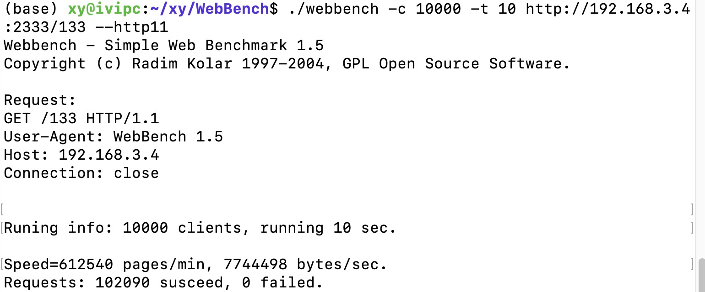

# Kyros High-Performance Network Library

自己写来练手的一个项目，希望有所收获。

Work hard to be a better man.  给自己加油💪🏻

## 概要

1、网络库基于Reactor模式，IO多路复用采用epoll的ET模式；

2、使用基于阻塞队列的线程池并发处理请求；

3、网络连接采用非阻塞IO，通过用户态缓冲来提高上层的代码的响应速度；

## 依赖

boost==1.75.0

gtest==1.10

## 测试结果
服务器配置如下：

|      CPU       | 内存 | 网络带宽 |
| :------------: | :--: | :------: |
| Intel i9-9900K | 32G  | 100Mbps  |

受限于网络带宽，服务器程序只启用1个线程（网络带宽太小，更多的线程暂时测不出区别😂）

每秒请求数：10209，每分钟请求页面：612540。

## 参考

Linux高性能服务器编程，游双.

Linux多线程服务端编程：使用muduo C++网络库，陈硕.

[muduo](https://github.com/chenshuo/muduo)
